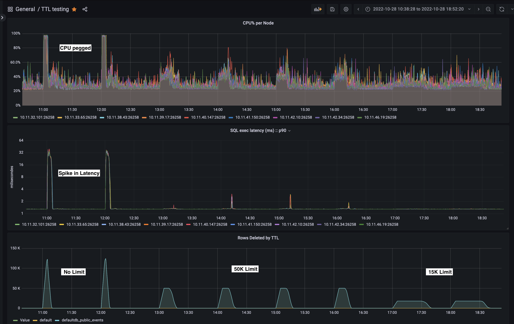

# Overview

Cockroach introduced the Time-To-Live (TTL) functionality in v22.1.0 as a preview release.  This initial release provided the ability to automatically expire stale data.  This feature allows developers to focus on providing better features instead of data life-cycle maintenance.   This functionally is enabled using optional [storage parameters](https://www.cockroachlabs.com/docs/stable/sql-grammar.html#opt_with_storage_parameter_list "storage parameters") to define expiration times for data.

```sql
CREATE TABLE ttl_test (
  id UUID PRIMARY KEY default gen_random_uuid(),
  description TEXT,
  inserted_at TIMESTAMP default current_timestamp()
) WITH (ttl_expire_after = '3 months');
```

As you would expect, the **ALTER TABLE** command can also be used to enable this functionality on existing tables.  This functionality was interesting to developers trying to optimize storage usage on pre-existing applications without built-in life-cycle maintenance.  However, when experimenting with preview release, it was discovered that TTL essentially adds a new column to trace the expiration time.  Adding a new column and back-filling it with data, essentially creates a whole new copy of the table essentially doubling the disk usage.  While this is fine for small tables, it is too much overhead for large existing tables.  Discussion of this behavior with large tables gave birth to the concept of the `ttl_expiration_expression`.

## ttl_expiration_expression

To avoid back-filling data, it was observed that typically there is an existing column that can be used to determine the expiration time.  Additionally, as one would expect, there are exceptions to keeping some rows even after the expiration time.

The `ttl_expiration_expression` storage parameter was introduced to enable this functionality.  Consider the following example table:

```sql
CREATE TABLE my_ttl_table (
    id INT8 NOT NULL,
    created_at TIMESTAMPTZ DEFAULT now(),
    updated_at TIMESTAMPTZ DEFAULT now() ON UPDATE now(),
    should_delete BOOL DEFAULT true,
    CONSTRAINT my_ttl_table_pkey PRIMARY KEY (id ASC)
);
```

The example below shows how to enable TTL on rows where the `updated_at` column is greater than 7 days and the `should_delete` *boolean* is true:

```sql
ALTER TABLE my_ttl_table 
SET (ttl = 'on', 
     ttl_expiration_expression = 
         "if(should_delete, 
           (updated_at AT TIME ZONE 'utc' + INTERVAL '7d') AT TIME ZONE 'utc', 
           NULL)",
     ttl_label_metrics = true);
```

The `ttl_expiration_expression` is used to evaluate whether a specific row should be deleted or not.  With the release of this functionality, the TTL performance was optimized to parallelize delete activity across all nodes in the cluster.  Each node is responsible for scanning and deleting data from a distinct set of spans.  The TTL activity is controlled by various [storage parameters](https://www.cockroachlabs.com/docs/stable/row-level-ttl.html#ttl-storage-parameters) to adjust the concurrency, batching, and even rate limiting of delete activity.

## Test scenario

Consider the example **events** table for a micro services application.  The **events** table is used to record activity across multiple services. 
 
```sql
CREATE TABLE IF NOT EXISTS events (
        uuid1 UUID NOT NULL,
        uuid2 UUID NOT NULL,
        created_at TIMESTAMPTZ NOT NULL,
        updated_at TIMESTAMPTZ NOT NULL,
        j JSONB NOT NULL,
        keep_record bool DEFAULT false,
        id1 INT8 NULL AS ((j->>'k1':::STRING)::INT8) STORED,
        id2 INT8 NULL AS ((j->>'k2':::STRING)::INT8) STORED,
        id3 INT8 NULL AS ((j->>'k3':::STRING)::INT8) STORED,
        id4 INT8 NULL AS ((j->>'k4':::STRING)::INT8) STORED,
        PRIMARY KEY (uuid1, uuid2),
        INDEX idx_keep (created_at ASC) WHERE keep_record = true
    );
```

For this test scenario, the [ingest_stress_plus.py](ingest_stress_plus.py) script is used to spawn 512 threads and **INSERT** data at a rate of 10K rows per second.  At this **INSERT** rate, the table is growing at about 250GB a day and becomes mostly stale after only 2 hours.  The desired goals of this test are:


- Enable TTL after the table has been growing for while
- Keep event INSERTs running at same steady state of 10K rows per second
- Less than 20% impact to P99 latency for INSERT traffic while TTL is running
- TTL should catch up on DELETE activity
- Steady State TTL after initial catch up
- Use `keep_record` boolean to identify records to be kept past the expiration date

## Test Results

After the table had grown for a few days to ~500GB, TTL was enabled to expire rows.  The `updated_at` timestamp column along with **INTERVAL** expression defines a time when a row can be expired.  Additionally, a check was enabled to keep rows where the `keep_record` boolean was enabled.

```sql
ALTER TABLE events 
SET (ttl = 'on', 
     ttl_expiration_expression = 
        "if(not keep_record, 
           (updated_at AT TIME ZONE 'utc' + INTERVAL '2h') AT TIME ZONE 'utc', 
           NULL)",
     ttl_label_metrics = true, ttl_range_concurrency = 1);
```

This only had one thread enabled per range, but the impact was too great CPU was pegged and application latency massively increased.



To reduce latency impact, the per node `ttl_delete_rate_limit` was dynamically adjusted for the test cluster with 9 nodes as shown below:

```sql
ALTER TABLE events SET (ttl_delete_rate_limit=5555);  -- 50k overall limit
ALTER TABLE events SET (ttl_delete_rate_limit=1666);  -- 15k overall limit
```

## Final Thoughts

The Time-to-Live functionality, control, and performance has really improved with the v22.2 release of CockroachDB.  Using TTL allows application teams to not have to design in an expiration routine and allows of them to focus on providing more value to their customers.

If you have questions about how to use this functionality with CockroachDB, don't hesitate to reach out.
